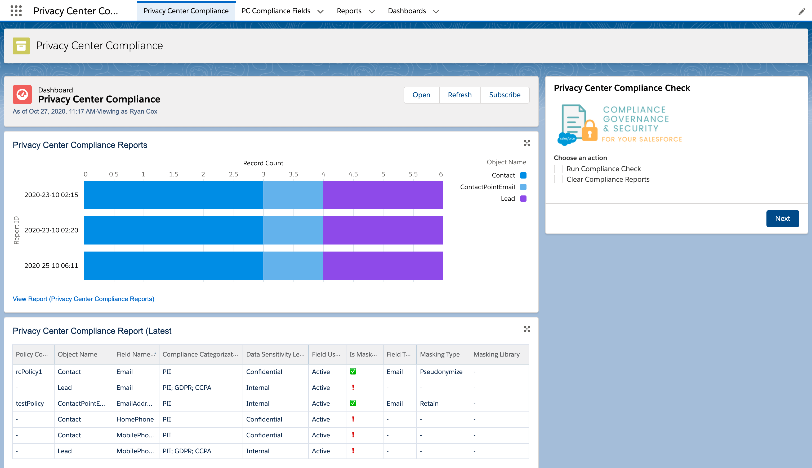
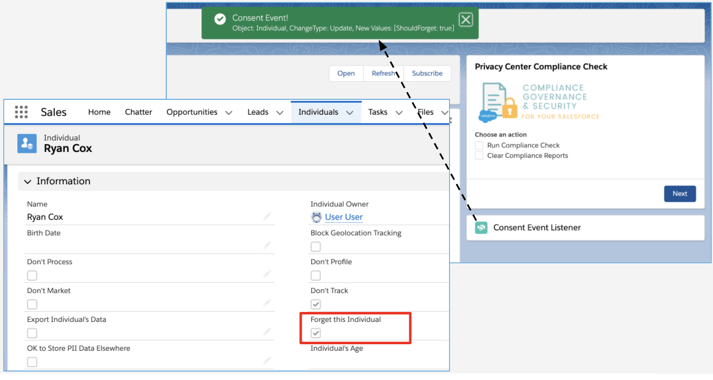

# sfdx-privacy-center-compliance

This is an SFDX project that extends Privacy Center functionality by matching fields with Compliance Categorization to  Privacy Policy configurations to identify fields that may need to be masked when being archived.

Also included is a Lightning web component that subscribes to the Platform Event channel '/event/ConsentEvent' to listen for consent-related events such as updates to Individual records.

## Development

To work on this project in a scratch org:

1. [Set up CumulusCI](https://cumulusci.readthedocs.io/en/latest/tutorial.html)
2. Run `cci flow run dev_org --org dev` to deploy this project.
3. Run `./scripts/assign-perm-set-to-user.sh` to assign permission set **RC_Privacy_Center_Compliance** to the scratch org user. 
4. Run `cci org browser dev` to open the org in your browser.